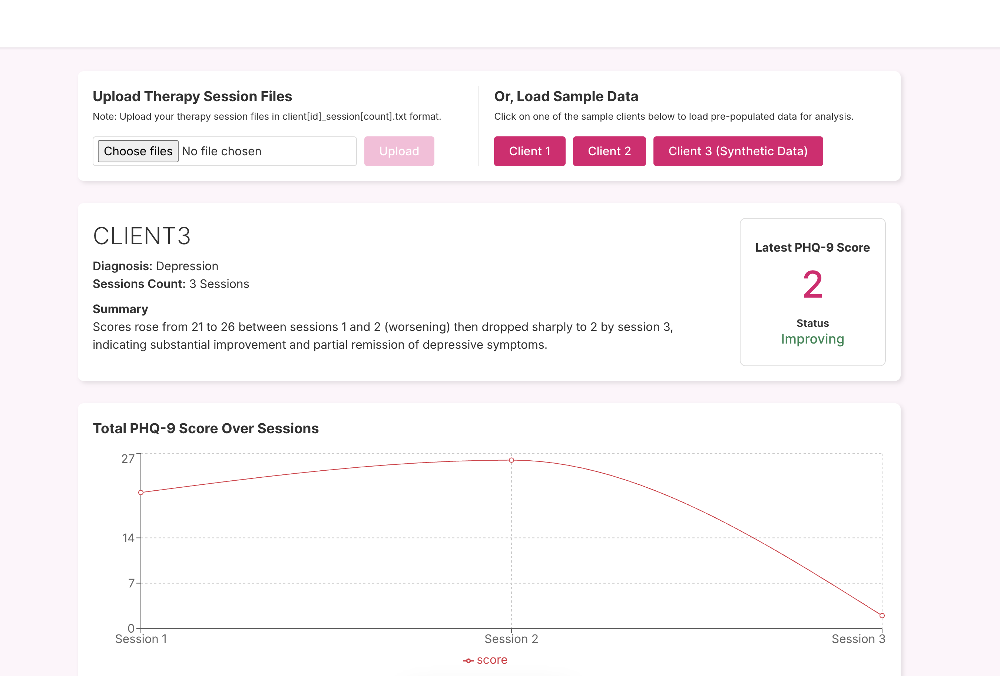
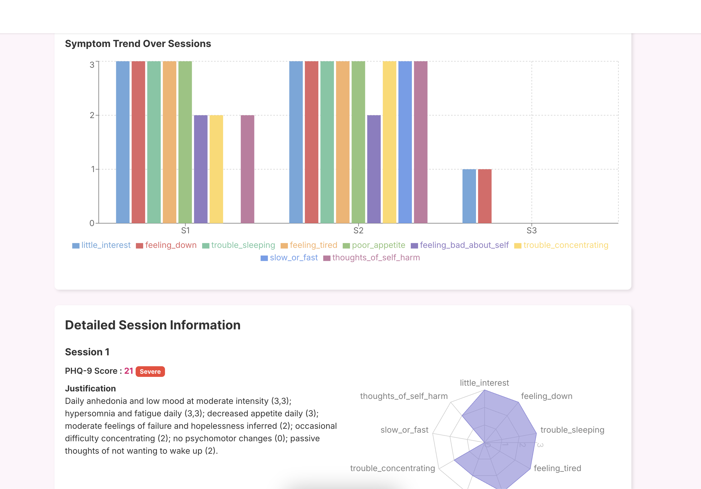
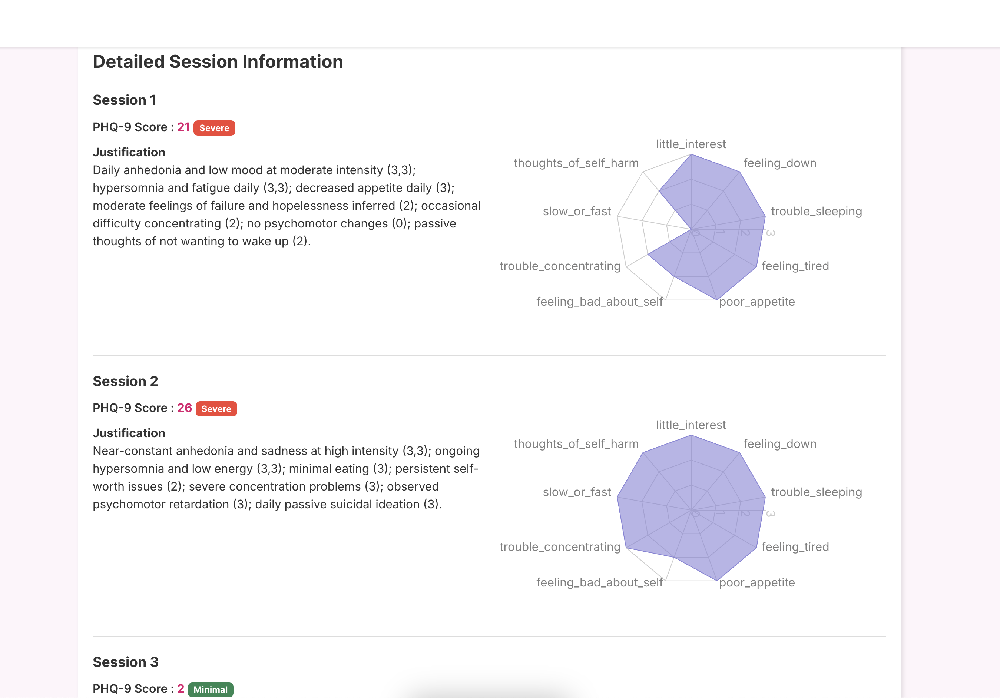
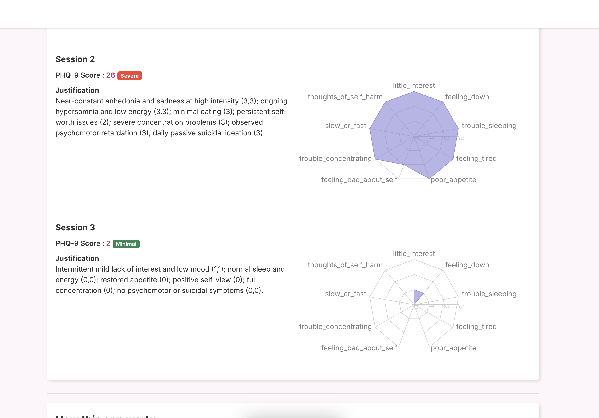

# AgenticAI Medical Assessment Project

## Overview

This project demonstrates an agentic AI system for medical/therapy session analysis. It processes session transcripts, scores mental health assessments, and visualizes client progress. The system is modular, with a Python backend (API and agent logic) and a modern frontend for data visualization.

---

## Demo Video

---

## Architecture

- **Backend (Python):**
  - API layer for serving data and running analysis.
  - Modular agent-based architecture for scoring and supervision.
  - Utilities for parsing, graph-based reasoning, and LLM integration.

- **Agents:**
  - GAD-7 and PHQ-9 scoring agents for mental health assessments.
  - Supervisory agent to validate and orchestrate outputs.
  - Graph-based reasoning for modular, extensible agent interactions.

- **Frontend (TypeScript/React):**
  - Visualizes client data, session trends, and assessment results.
  - Modern UI with reusable components.

- **Data:**
  - Sample session transcripts and documentation for testing and demonstration.

---

## Major Modules

### Backend (`api/` and `medi_graph/`)

- **`api/main.py`**: Entry point for the backend API. Handles requests and orchestrates analysis.
- **`medi_graph/graph.py`**: Core logic for building and traversing agent graphs.
- **`medi_graph/llm.py`**: Integrates with large language models for advanced reasoning.
- **`medi_graph/run_graph.py`**: Runs the agent graph on input data.

#### Agents (`medi_graph/agents/`)

- **`gad_7_scorer.py`**: Scores the GAD-7 anxiety assessment from session data.
- **`phq_9_scorer.py`**: Scores the PHQ-9 depression assessment.
- **`supervisor.py`**: Supervisory agent for orchestrating and validating agent outputs.

#### Data

- **`sample_data/`**: Example session transcripts for testing.

---

### Frontend (`frontend/`)

- **React-based UI** for visualizing:
  - Client session summaries
  - Assessment trends (GAD-7, PHQ-9)
  - Therapy progress and heatmaps

---

## Functionality

- **Session Parsing:** Reads and processes session transcripts.
- **Agentic Reasoning:** Uses a graph of agents (scorers, supervisors) for modular, extensible analysis.
- **Assessment Scoring:** Automatically scores GAD-7 and PHQ-9 from session text.
- **Visualization:** Presents client progress and assessment trends in an interactive UI.

---

## Getting Started

1. **Backend:**  
   - Install Python dependencies from `api/requirements.txt`.
   - Run the API server via `api/main.py` by executing `uvicorn main:app`.

2. **Frontend:**  
   - Install dependencies with your preferred package manager (e.g., `pnpm install`).
   - Start the frontend with `pnpm run dev`.

3. **Data:**  
   - Use sample transcripts in `medi_graph/sample_data/` or `docs/` for testing.

---

## Screenshots

---
