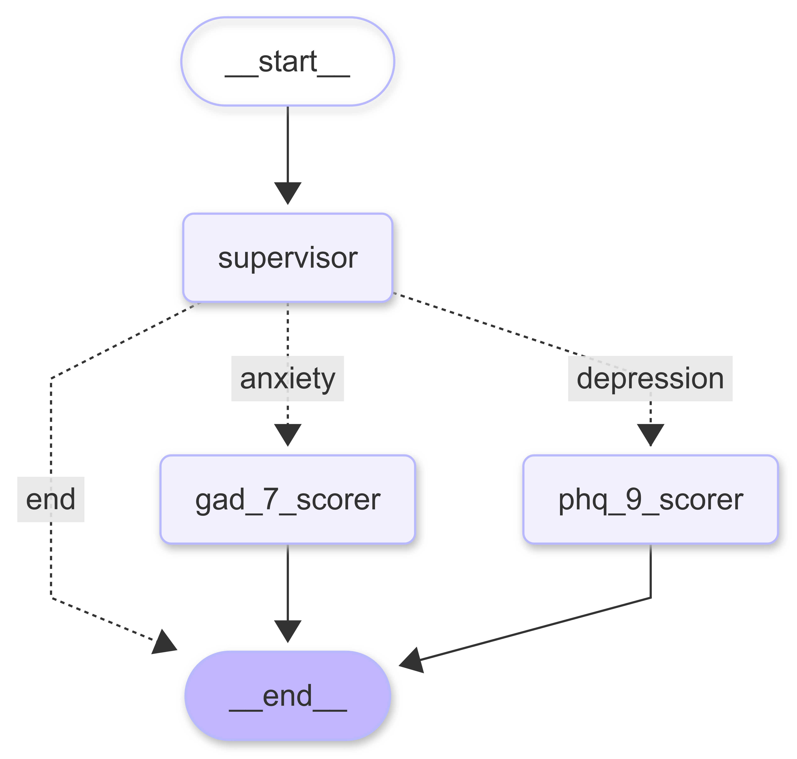

# Therapy Agent

## Overview

Therapy Agent is an advanced system designed for the analysis of medical and therapy sessions. It processes session transcripts, automatically scores mental health assessments, and visualizes client progress over time. The architecture is modular, featuring a robust Python backend (API and agent logic) and a modern frontend for interactive data visualization. The app is deployed here : [Therapy Agent](https://therapy-agent.streamlit.app/).

## Key Features

- **Session Parsing:** Efficiently reads and processes structured and unstructured session transcripts.
- **Agentic Reasoning:** Employs a graph of specialized agents (scorers, supervisors) for modular, extensible analysis.
- **Automated Assessment Scoring:** Accurately scores GAD-7 and PHQ-9 assessments directly from session text.
- **Visualization:** Presents client progress, assessment trends, and therapy insights in an interactive UI.

## Research

### Understanding Project Objectives

The primary goal was to develop an application capable of tracking and analyzing mental health assessments across multiple therapy sessions. A unique challenge was that all data was provided in free-text format but structured in JSON, necessitating the use of advanced NLP techniques to extract and quantify relevant clinical information. However, a LLM based approach was deemed more suitable than traditional NLP methods due to the complexity and ease of integration for reasoning and scoring.

### Domain Exploration

Given limited prior exposure to the mental health domain, I conducted in-depth research into the GAD-7 and PHQ-9 assessments to understand their clinical significance, scoring criteria, and interpretation. I reviewed therapy session transcripts multiple times to identify important key words, symptom descriptions that could help in automated scoring.

### System Design and Methodology

#### Architectural Choices

I evaluated two primary approaches: a Retrieval-Augmented Generation (RAG) pipeline versus an agentic reasoning framework. I selected the agentic reasoning paradigm for its modularity, scalability, and ease of extension. This architecture enables seamless integration of new assessments and analytical agents as project requirements evolve.

To achieve fine-grained control over the agents, I developed a custom agentic framework using LangGraph, which offers seamless integration with LLMs and custom logic. While alternatives like CrewAI and LlamaIndex were considered, LangGraph provided greater flexibility and was ultimately better aligned with the project’s requirements.  

For frontend, I didn't choose Streamlit, as I wanted to build a more interactive and visually appealing UI. I opted for a React-based frontend, which allows for greater customization and responsiveness. Another reason was that Streamlit apps sleeps after a certain period of inactivity.

#### Prompt Engineering and NLP Strategy

Initial attempts involved passing entire session transcripts to the LLM for assessment scoring, which proved inefficient due to high token consumption and context dilution. Through iterative refinement, I engineered prompts to focus on transcript sections most relevant to GAD-7 and PHQ-9 criteria. This targeted approach improved both accuracy and computational efficiency.

For classifying the diagnosis, I implemented a two-step process:

1. **Using brute force search:** I utilized brute force search for particular keywords and phrases indicative of symptoms. In case I was not able to extract the diagnosis, I used the below method.
2. **Using LLM:** I then used these extracted symptoms to classify the diagnosis, leveraging the LLM's ability to reason about symptom patterns and clinical criteria.

This hybrid approach is better as it minimizes token usage and also is faster than using LLM for the entire transcript.

#### Output Structuring and Usability

Raw LLM outputs are often verbose and inconsistent. To ensure actionable and user-friendly results, I adopted the perspective of a practicing therapist, designing structured outputs that are both generic (for extensibility) and specific (for clinical utility). Each assessment output includes a concise summary, symptom highlights, and a detailed score breakdown. Pydantic models enforce output consistency and facilitate downstream processing. You can find the output structure in `medi_graph/agents/**.py`.

#### Model Evaluation

I benchmarked both open-source (Llama 3) and proprietary (OpenAI GPT-4.1) language models. While both delivered reliable results, GPT-4.1 demonstrated superior output quality, consistency, and handling of complex, structured prompts. For development and experimentation, Llama 3 suffices; for production, GPT-4.1 is recommended.  
For testing the app, I was  provided with sample data of 2 clients, with 2 sessions each. Both clients were suffering from anxiety. However, I wanted to test my app for a patient with depression, so I created a sample session transcript for a patient with depression using GPT. This was to ensure that the app can handle a variety of cases and is not limited to just anxiety assessments.
Since the LLM outputs numbers, I have also structured the prompt to provide with a justification for the score. This is to ensure that the LLM is not just providing a score, but also reasoning about the symptoms and their severity. This is important for clinical use, as it provides a rationale for the score and helps in understanding the patient's condition better.

Hovever, It is very important to note that that these scores should be vetted by a qualified mental health professional before being used in any clinical setting.

---

### Challenges and Lessons Learned

- **Data Complexity:** Extracting structured insights from nuanced, free-text clinical notes required careful prompt engineering and iterative refinement.
- **Token Efficiency:** Managing LLM context windows and minimizing unnecessary input was critical for performance and cost.
- **User-Centric Design:** Structuring outputs for real-world clinical utility involved close consideration of therapist workflows and information needs.

---

## Scope for improvement

- **Session Count Limitation:** The current implementation has been tested on max 3 session per client. Hovever, to extend this to more sessions, we can save previous session data in a database and retrieve it as needed, rather than passing all session data to the LLM at once.   Also, if multiple session are uploaded in one go, we will have to implement a loop to process batches of sessions, as the LLM context window is limited, And then combine the results for each session along with summarization of text data from all sessions.
- **Extending Agent Capabilities:** Future work could include additional assessments (e.g., PTSD, OCD) and more complex reasoning agents.
- **Enhanced Visualization:** Implementing more advanced data visualizations (e.g., heatmaps, trend analysis) to provide deeper insights into client progress.

## Demo Video

---

## Architecture

- **Agents:**
  - GAD-7 and PHQ-9 scoring agents for mental health assessments.
  - Supervisory agent for validation and orchestration.
  - Graph-based reasoning for modular, extensible agent interactions.

---

## Deployment and Hosting

- **App:** : [Streamlit](https://streamlit.io/) is used for hosting the interactive UI.
- **LLMs:** : OpenAI's GPT-4.1 api is utilized for lenguage model capabilities, with Llama 3 as a fallback for development.

## Modules

#### Agents (`medi_graph/agents/`)

- **`gad_7_scorer.py`**: Scores the GAD-7 anxiety assessment from session data.
- **`phq_9_scorer.py`**: Scores the PHQ-9 depression assessment.
- **`supervisor.py`**: Supervisory agent for orchestrating and validating agent outputs.

#### Data

- **`sample_data/`**: Example session transcripts for testing.

---

## Getting Started

**Prerequisites:**

- Make sure you have api keys for OpenAI or TogetherAI, and set them in the `.env` file in the `root` directory. A template file is provided as `.env.template`.

1. **Data:**  
   - Use sample transcripts in `medi_graph/sample_data/` or `docs/` for testing.

---
